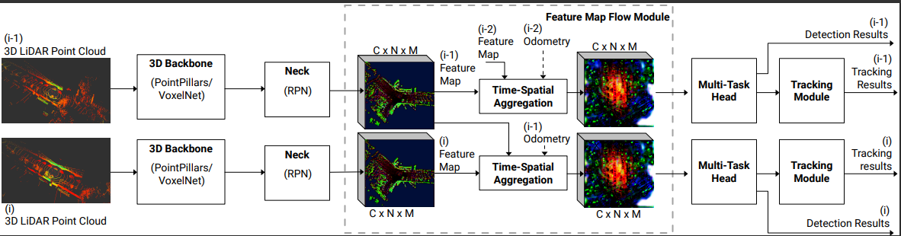
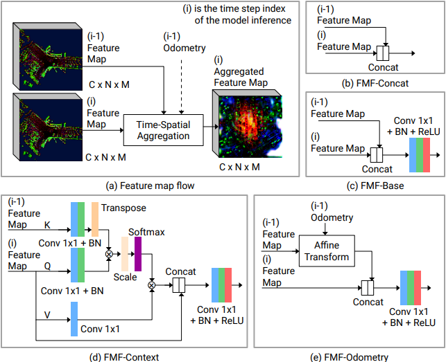

# Official Pytorch implementation for "FMFNet: Improve the 3D Object Detection and Tracking via Feature Map Flow" Paper [accepted in IJCNN-2022]  
  

<!-- ### FMF main pipeline:
 -->

### FMF main blocks:

### FMF Demo:

Code and results will be updated after publishing the paper!

## Abstract
Three-dimensional object detection and tracking from point clouds are important computer vision tasks for robots and vehicles where objects can be represented as 3D boxes. Improving the accuracy of understanding the environment is critical for successful autonomous driving.This paper presents a simple yet efficient method called “Feature Map Flow, FMF” for 3D object detection and tracking, considering time-spatial feature map aggregation from different timesteps of deep neural model inference. Several versions of the FMF are proposed: from common concatenation to context-based feature map fusion and odometry usage for previous feature map affine transform.
The proposed approach significantly improves the quality of 3D detection and tracking baseline on the nuScenes and Waymo benchmarks.
The software implementation of the proposed method has been carried out for the server platform and the NVidia Jetson AGX Xavier single-board computer. Its results have demonstrated high application prospects both for automated 3D point cloud labeling and for embedded on-board vehicle systems.

## Main Results
#### 3D detection on nuScenes test set 

| Model       |  MAP ↑  | NDS ↑  | FPS ↑|
|:-----------:|:-------:|:------:|:----:|
|VoxelNet     |  58.0   | 65.9   | 17   |    
|PointPillars |  53.8   | 62.7   | 29   |    

#### 3D Tracking on nuScenes test set 

| Model        | AMOTA ↑ | IDS ↓   |
|:------------:|:-------:|:-------:|
| VoxelNet     |   61.2  |  870    |       
| PointPillars |   58.1  |  736    |  

#### 3D detection on Waymo test set 

| Model              |  Veh ↑  | Ped ↑  | Cyc ↑ | mAPH ↑ | Latency,ms |
|:------------------:|:-------:|:------:|:-----:|:------:|:----------:|
|VoxelNet            | 70.74   | 65.46  | 67.63 | 67.95  | 86.11      |    
|PointPillars (FP16) | 69.65   | 54.61  | 62.28 | 62.18  | 62.30      |    

#### 3D detection on Waymo Val set 

| Model              |  Veh ↑  | Ped ↑  | Cyc ↑ | mAPH ↑ | Latency,ms |
|:------------------:|:-------:|:------:|:-----:|:------:|:----------:|
|VoxelNet            | 66.68   | 63.62  | 68.64 | 65.98  | 86.11      |    
|VoxelNet (FP16)     | 66.68   | 63.06  | 67.24 | 65.85  | 77.53      |    
|PointPillars        | 62.35   | 59.67  | 66.71 | 62.43  | 82.06      |    
|PointPillars (FP16) | 61.75   | 58.12  | 65.26 | 62.19  | 62.30      |  

All results are tested on a RTX 3060 ti GPU with batch size 1.

## Use FMFNet
Follow the provided steps to reproduce our results on nuScenes validation and test sets and get pretrained models.

Please refer to [INSTALL](/docs/INSTALL.md) to run the docker container for FMFNet.
For training and testing on nuScenes, please follow the instructions in [START](/docs/START.md).
For WAYMO dataset, you can check [START_WAYMO](/docs/START_WAYMO.md)

## Lisence
FMFNet is released under MIT license (see [LICENSE](LICENSE)). It is developed based on a forked version of [CenterPoint](https://github.com/tianweiy/CenterPoint). We also used code from [det3d](https://github.com/poodarchu/Det3D), [CenterNet](https://github.com/xingyizhou/CenterNet) and [CenterTrack](https://github.com/xingyizhou/CenterTrack). 

## Contact
Questions and suggestions are welcome! 

Youshaa Murhij [yosha[dot]morheg[at]phystech[dot]edu](mailto:)  
Dmitry Yudin [yudin[dot]da[at]mipt[dot]ru](mailto:) 
